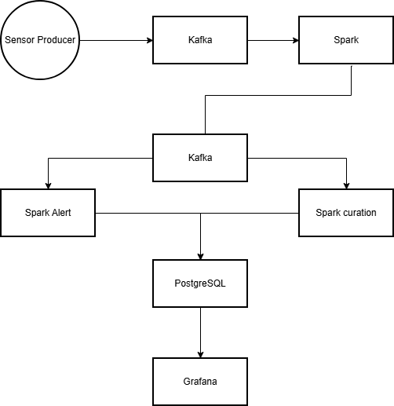

## Architecture

This sensor pipeline uses the folowing services:
    - Apache Kafka
    - Apache Spark
    - PostgreSQL
    - Grafana
    - PGadmin

These services work together using docker compose.

Sensor producer:

    Sensor readings are created by a python script running in a Docker container.
    The system in this configuration only handles 10 sensor readings every second but it is designed to handle 180 sensors readings every second. 
    Each reading is uploaded to Kafka using kafka-python.

Apache Kafka:

    Kafka acts as a distributed event streaming platform that decouples producers and consumers.

    Kafka makes sure:
        - all stages of data are seperated
        - multiple services can acces the same data stream
        - that all sensor readings get processed

Apache Spark:

    Apache Spark is used to proces all the sensor readings using Spark Structured streaming. 

    Spark performs the following jobs:

        * Clean the sensor reading 
            - Ensure the sensor readings have the right schema and are in the right format

        * Alert generation
            - If a sensor value exceeds a predefined boundry an alert is created in
              Kafka and PostgreSQL 

        * Data curation
            - Missing values get forwardfilled and anomalies are detected in the data

    Sparks runs in isolated containers managed by Docker, this ensure fault tolerance on infrastructure level.  

PostgreSQL:

    PostgreSQL is used as the primary database to store the data that the dashboard needs to acces.
    A relation database is chosen because it allows for easy querying.

PGadmin:

    Provides a web-based interface for database inspection and query execution.

Grafana:

    Grafana makes visualization of the data possible by using its dashboard. 
    It connects to the the PostgreSQL database and displays the data in the dashboard.
    Since it is provisioned it takes minimal effort to make changes.
