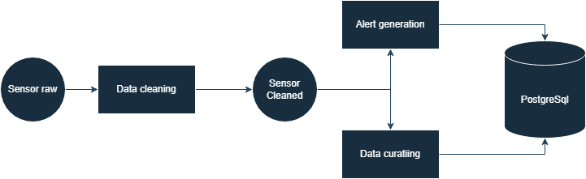

# Data flow

### 1. Data Generation:

    Sensor readings are created by a python script running in a docker container.
    
    An example of an sensor reading:
    
    {
        sensor_id   : 10,
        timestamp   : 2026-03-02T10:00:00,
        temperature : 22.4,
        humidity    : 50.4,
        co2         : 645
    }

### 2. Data ingestion:

    Sensor readings are sent to the sensor_raw topic in Apache Kafka.
    Each Sensor reading is sent seperatly by the docker container that generates the data.

### 3. Data stream processing

    

    The streaming pipeline consist of the following transformations:

#### Data Cleaning:
The data cleaning job:
- validates if the data has all the expected columns
- casts the data into the right type
- checks in values are within expected ranges
- sends faulty data to a Dead-letter queue
- sends the data to the sensor cleaned topic in Kafka 

#### Data Curation:
The data curating job:
- drops duplicate readings
- fills empty temperature, humidity and co2 values
- checks for sensor anomalies
- writes the data to the postgreSQL database
    
#### Alert generation:
    Alerts are generated when value exceed certain thresholds.
    
